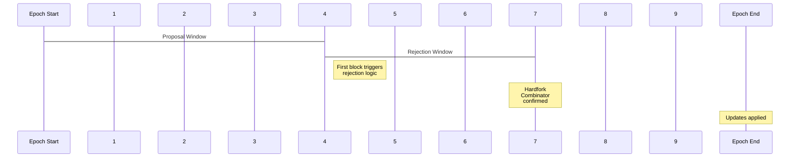

# Cardano Improvement Proposals (CIPs)

```mermaid
sequenceDiagram
    participant s0 as Epoch Start
    participant s1 as 1
    participant s2 as 2
    participant s3 as 3
    participant s4 as 4
    participant s5 as 5
    participant s6 as 6
    participant s7 as 7
    participant s8 as 8
    participant s9 as 9
    participant sA as Epoch End

    s0->s4: Proposal Window
    s4->s7: Rejection Window

    Note right of s4: First block triggers<br>rejection logic
    Note over s7: Hardfork<br>Combinator<br>confirmed
    Note over sA: Updates applied
```
